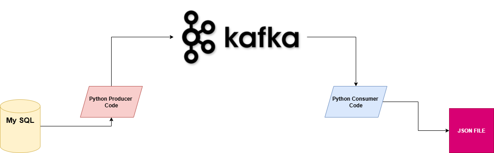
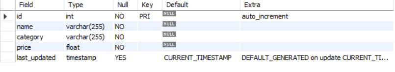

# Sql-to-Json End to End Real time Pipeline using Kafka

### About
This project demonstrates a real-time data pipeline using Apache Kafka. A custom Python producer continuously monitors a MySQL table and publishes new records to a Kafka topic as soon as they are inserted. On the other side, a consumer subscribes to this topic, processes the incoming records, and writes them into separate JSON files for storage or further use. The project also highlights Kafka’s partition–consumer mapping feature, showing that a single partition can only be consumed by one consumer instance within a consumer group.

#### Pre-requisites
- Python 3.7 or later
- Confluent Kafka Python client
- MySQLDatabase
- Apache Avro
- Asuitable IDE for coding (e.g., PyCharm, Visual Studio Code)

1. Creating Sql Table

   First we have to create our database and table in Mysql you find in [here](assgn.sql)
   Table Schema
   
