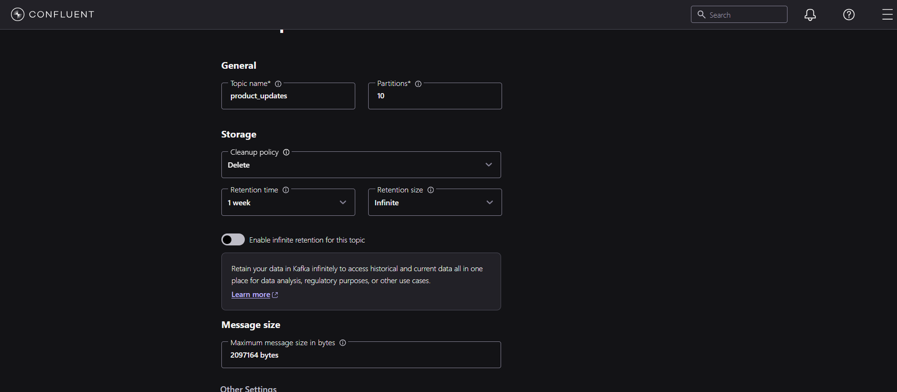

# Sql-to-Json End to End Real time Pipeline using Kafka

### About
This mini project demonstrates a real-time data pipeline using Apache Kafka. A custom Python producer continuously monitors a MySQL table and publishes new records to a Kafka topic as soon as they are inserted. On the other side, a consumer subscribes to this topic, processes the incoming records, and writes them into separate JSON files for storage or further use. The project also highlights Kafka’s partition–consumer mapping feature, showing that a single partition can only be consumed by one consumer instance within a consumer group.

#### Pre-requisites
- Python 3.7 or later
- Confluent Kafka Python client
- MySQLDatabase
- Apache Avro
- Asuitable IDE for coding (e.g., PyCharm, Visual Studio Code)

1. Creating Sql Table

   First we have to create our database and table in Mysql you can find in the respective sql file [here](assgn.sql)
   Table Schema
   

2. Creating Kafka Producer code

   The python script is created in a way to keep track of the last read timestamp and id of the records from MySql table and fetch only new records. They query was
   
   
   
   Here we also serialzie our records in **Avro** format.
   and publish the records into a kafka topic named product_updates. The ID column is used a key for paritioning, also it is **String Serialized**. Python script publishesh the code every 1 second and polls MySql
   to check for new records every 3 seconds.
   You can find the respective python producer file [here](producer.py)

4. Creating the Kafka Cluster and Topic and Configuring

   - First we create a Kafka **Cluster**
   - After that I have created a topic named **product_updates** where there are **10 Partitions** everything else default.
     
     
     
   - After that I have set the appropriate **Data Contract** for value in **Avro** format.
     
     

   - For Key we are using **String Serializer** hence no Data Contract for it.
  
     

5. Creating the Kafka Consumer code

   Consumer python script fetches data from kafka topic and **De-serializes** from Avro into python object. It also applies a small transformation in the records which is applying discount to products if they        belong to a certain category. Then the objects are transformed into json format and appended into a json file.
   You can the three users.json file [here](https://github.com/eli-shen08/Sql-Kafka).

   

   In the above pic in the second and third record discount was applied since their category was **books**.
   I have run 3 consumer scripts parallely which write to three different json files. If you look in the json files no records belongs to more than one json file.
   This shows a kafka property that **One partition in kafka topic can cater to only one consumer**.

   ## Steps to Run it.
   1. Create appropriate MySql table
   2. Create Kafka Cluster and Topic and Configure
   3. Create and set the API keys
   4. Run Producer code and consumer code
   5. Insert records into the sql table
   6. And watch it unfold.
  
If you want to see a video of this mini project click [here](https://www.linkedin.com/posts/rahul-mondal08_dataengineering-apachekafka-streaming-activity-7368382456648986624-XZgT?utm_source=share&utm_medium=member_desktop&rcm=ACoAAD7SvPEBnRDCQRQtqP9ijHIkwsG9Z5eecsA)
   
   

        
   
   
